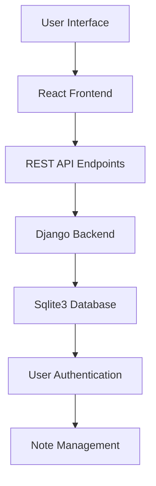
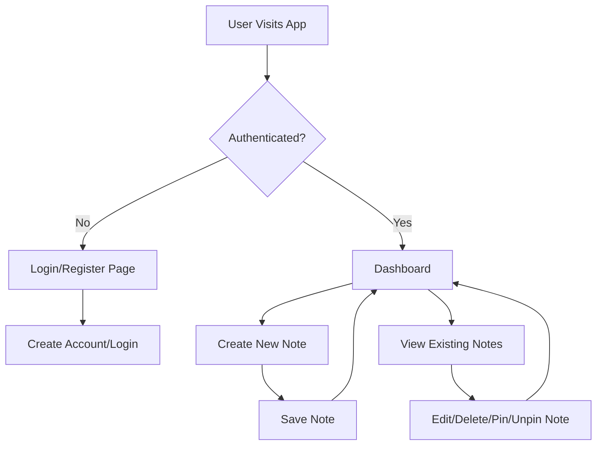
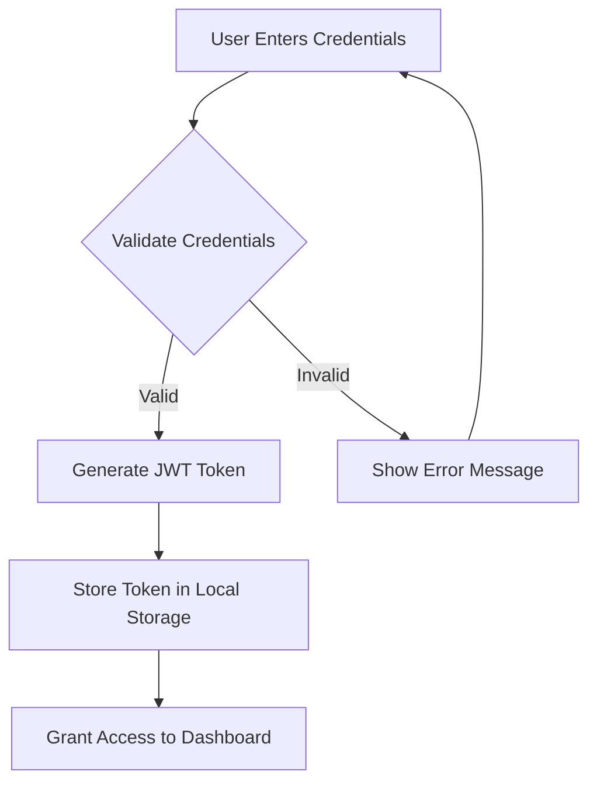

# Full Stack Note Application 📝

## 🌟 Project Overview

This repository contains a full-stack note-taking application built using Django(DRF) for the backend and ReactJS for the frontend. The application allows users to create, read, update, pin, unpin and delete notes efficiently.

## 🚀 Project Architecture



## ✨ Key Features

- 🔐 Secure User Authentication using Django Restframework JWT
- 📝 Create, Read, Update, Pin/UnPin and Delete (CRUD) Note Operations
- 💻 Responsive and Intuitive Design
- 🔒 Secure Backend with JWT Authentication
- 🚀 Real-time Note Management

## 🛠 Technology Stack

### Frontend
- React.js
- JavaScript
- HTML5
- TailwindCss

### Backend
- Django
- Django Rest Framework
- Sqlite3
- JWT Authentication

## 🔄 User Workflow



## 🛡️ Authentication Flow



## 📦 Installation

### Prerequisites
- Python 3.8+
- Node.js 18+
- Sqlite3

### Backend Setup
```bash
# Clone the repository
git clone https://github.com/AdityaK0/FullStackNoteApp-Django-ReactJs.git

# Navigate to backend directory
cd backend

# Create virtual environment (Optional if you have env)
python -m venv venv
source venv/bin/activate  # On Windows use `venv\Scripts\activate`

# Install dependencies
pip install -r requirements.txt

### Follow this order to avoid migration issues due to CustomUser model dependency

# Step 1: Apply migrations for the users app

python manage.py makemigrations users
python manage.py migrate users

# Step 2: Apply migrations for the notes app

python manage.py makemigrations notes
python manage.py migrate notes

# Step 3: Apply any remaining migrations

python manage.py makemigrations
python manage.py migrate

# Run backend server
python manage.py runserver 7070
```

### Frontend Setup
```bash
# Navigate to frontend directory
cd frontend

# Install dependencies
npm install

# Start development server
npm run dev
```

### Usage
Access the Application: Open http://localhost:5173/ in your browser.
Register/Login: Create an account or log in.
Manage Notes: Add, edit, delete, pin , unpin and search for notes.
Token Management: The application automatically refreshes access tokens when needed.


