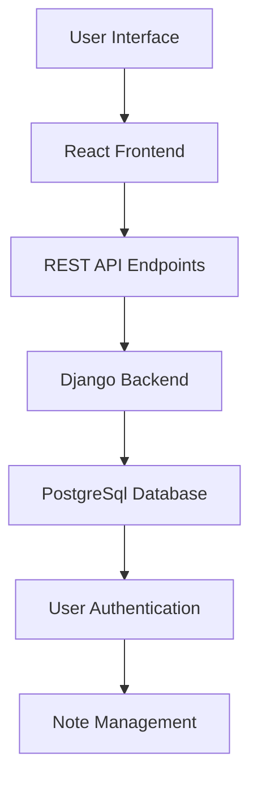
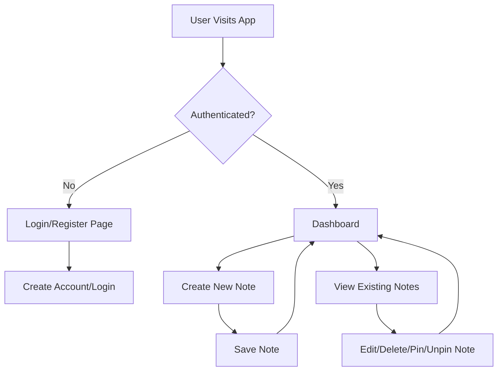
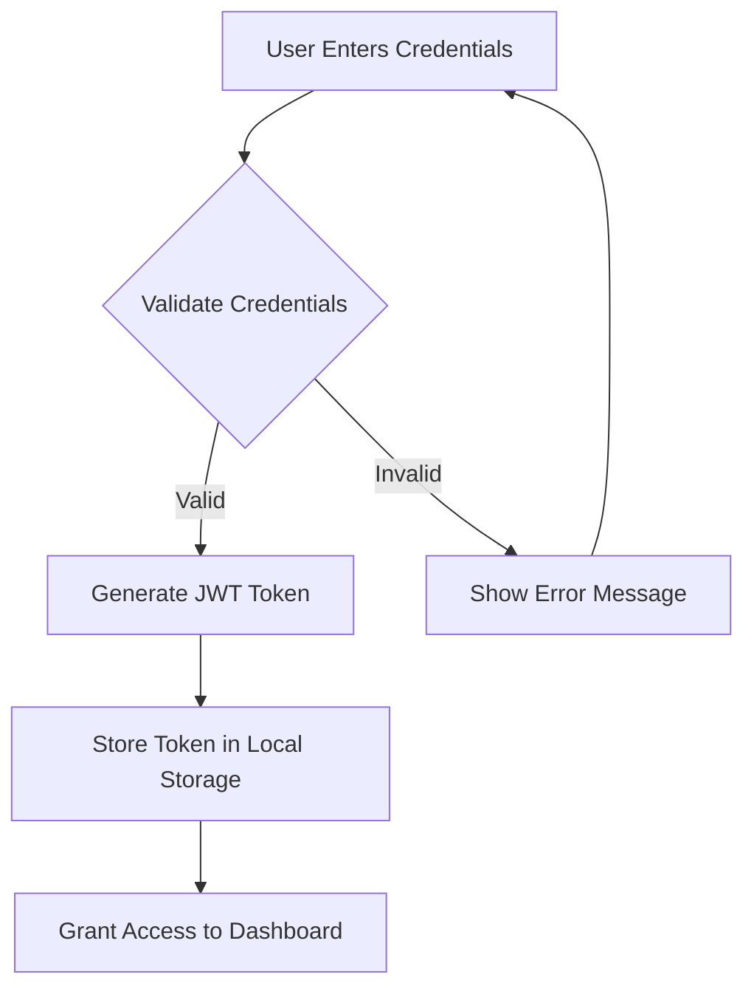

# Full Stack Note Application 📝

### Application is Live! 
Link - https://noteapphub.netlify.app/login/


## 🌟 Project Overview

This is a full-stack note-taking application built using Django (DRF) for the backend and ReactJS for the frontend. It features secure user authentication with JWT, allowing users to register, log in, and logout. The application enables seamless CRUD operations on notes, including creating, reading, updating, deleting, pinning and unpinning. Additionally, it supports token management, automatic token refresh, and blacklist handling for enhanced security.

## Deployment 

This application is deployed on an AWS EC2 instance using Nginx as a reverse proxy and Gunicorn for running the Django backend. The domain is managed using DuckDNS for dynamic DNS, and Let's Encrypt SSL is used to secure HTTPS access.

Additionally:

Frontend is deployed on Netlify for a seamless and fast user experience.

Database is hosted on NeonDB, a cloud-based PostgreSQL solution for efficient and scalable data storage.

Now, the application backend can be accessed securely at https://noteapphub.duckdns.org with full JWT authentication and a responsive note management system! 🚀

## 🚀 Project Architecture



## ✨ Key Features

- 🔐 Secure User Authentication using Django Restframework JWT
- 📝 Create, Read, Update, Pin/UnPin and Delete (CRUD) Note Operations
- 💻 Responsive and Intuitive Design
- 🔒 Secure Backend with JWT Authentication
- 🚀 Real-time Note Management

## 🛠 Technology Stack

### Frontend
- React.js
- JavaScript
- HTML5
- TailwindCss

### Backend
- Django
- Django Rest Framework
- PostgreSql
- JWT Authentication

## 🔄 User Workflow



## 🛡️ Authentication Flow



## 📦 Installation

### Prerequisites
- Python 3.8+
- Node.js 18+
- PostgreSql

### Backend Setup (Please follow the backend steps carefully and stepwise)
```bash
# Clone the repository
git clone https://github.com/AdityaK0/FullStackNoteApp-Django-ReactJs.git

# Navigate to backend directory
cd backend

# Create virtual environment (Optional if you have env)
python -m venv venv
source venv/bin/activate  # On Windows use `venv\Scripts\activate`

# Install dependencies
pip install -r requirements.txt

### Follow this order to avoid migration issues due to CustomUser model dependency

# Step 1: Apply migrations for the users app

python manage.py makemigrations users
python manage.py migrate users

# Step 2: Apply migrations for the notes app

python manage.py makemigrations notes
python manage.py migrate notes

# Step 3: Apply any remaining migrations

python manage.py makemigrations
python manage.py migrate

# Run backend server
python manage.py runserver 7070
```

### Frontend Setup
```bash
# Navigate to frontend directory
cd frontend

# Install dependencies
npm install

# Start development server
npm run dev
```

## Usage

- **Access the Application**: Open [`[https://noteapphub.netlify.app/login`](https://noteapphub.netlify.app/login) in your browser.  
- **Register/Login**: Create an account or log in securely using JWT authentication.  
- **Manage Notes**: Add, edit, delete, pin, unpin, and search for notes effortlessly.  
- **Token Management**: The application automatically refreshes access tokens and handles blacklisting on logout for enhanced security.  


